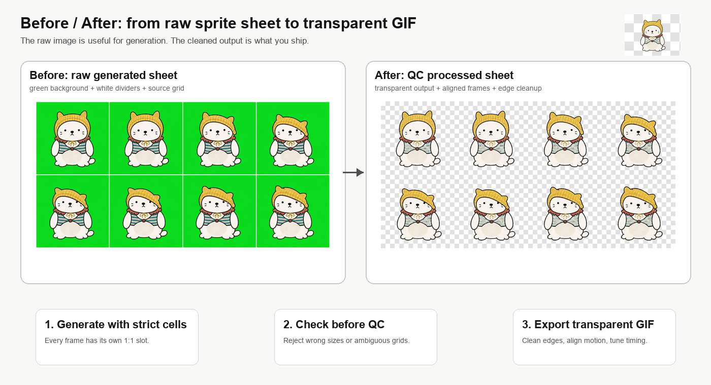
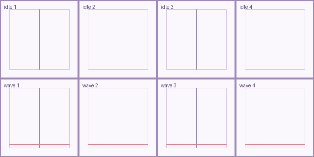
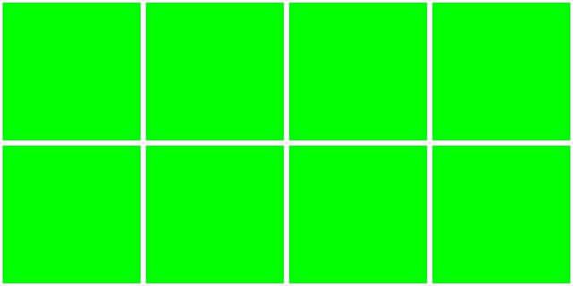
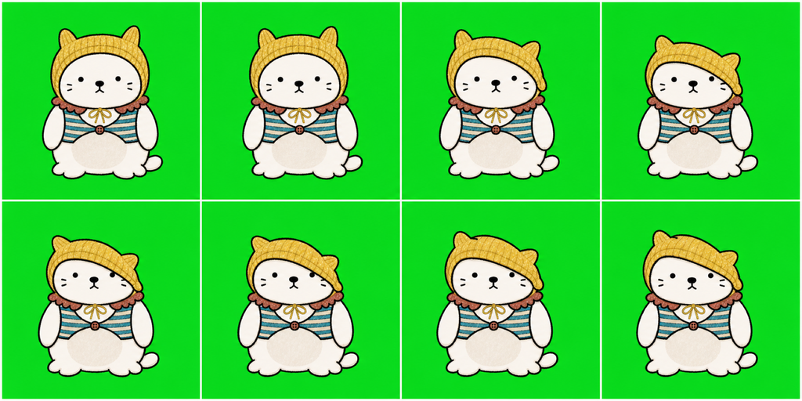

# Animation Sprite Skills

AI 画出一张“看起来像雪碧图”的图片很容易，真正难的是让它变成可以被程序稳定切帧、对齐、去背景、导出透明 GIF 的动画资产。

这个仓库整理了两个 Codex skill：

- `animation-sprite-workshop`：在生图前先把雪碧图规格定清楚，避免模型只画出“视觉上像格子”的图。
- `animation-qc`：在生图后做切帧、去绿底、清理分隔线、对齐主体、导出透明 GIF 和检查报告。

它们解决的是同一个问题：把 AI 生成图从“好看”推进到“能用”。



左边是模型生成的 raw sheet：有绿底、有白色分隔线，适合作为中间源。  
右边是 QC 后的透明资产：主体被放回稳定的方格里，背景和边缘残线被清理，可以继续导出 GIF 或接入产品。

## 为什么需要这套流程

很多 sprite 问题不是画风问题，而是几何问题。

比如提示词里写了 `4x2 sprite sheet`，模型可能真的画出 4 列 2 行，但下载到本地的图片尺寸却不是标准 `2:1`。人眼看着像格子，脚本一切就会出错：每格不是正方形，主体位置漂移，或者某些分隔线被当成角色内容带进 GIF。

所以这里先把规则拆开：

- 每一帧必须在独立的 `1:1` 方格里。
- 整张图比例必须等于 `cols:rows`，例如 `4x2` 就是 `2:1`。
- 主体不能跨格，不能贴边，不能让道具或特效挡住身体锚点。
- raw sheet 可以用绿底和白线做中间源，但最终资产必须透明。
- QC 不是重画工具。动作本身坏了，就应该回到生图阶段重做。

这也是为什么 workflow 里要先有 contract，再有 raw sheet，最后才进入 QC。


## 一张图从哪里开始变标准

标准不是在最后导出 GIF 时才补救，而是在生图前就确定。

`animation-sprite-workshop` 会先写清楚这张 sheet 的规格：

```yaml
cols: 4
rows: 2
frame_count: 8
target_canvas_px: [2048, 1024]
target_cell_px: [512, 512]
cell_aspect: 1:1
whole_sheet_aspect: 4:2
playback: loop
```

这份 contract 的作用很直接：告诉模型、脚本和后续 QC，整张图应该是什么比例，每个 cell 应该多大，哪些格子有效，哪些格子是占位。

生图时可以使用 layout guide 或 raw template 辅助模型理解格子结构：





但 guide 只是施工图，不是最终素材。最终素材仍然要通过几何检查。

```bash
python3 animation-sprite-workshop/scripts/check_sprite_gate.py \
  --input /path/to/raw-sheet.png \
  --cols 4 \
  --rows 2 \
  --target-width 2048 \
  --target-height 1024 \
  --target-cell 512 \
  --allow-guide-background \
  --check-visible-grid
```

只有通过 sprite gate 的图，才适合进入 `animation-qc`。

## Raw Sheet 示例

这类图适合作为中间源：



它有几个优点：

- 4 列 2 行清楚。
- 每格只有一个完整主体。
- 绿底容易抠除。
- 白线能帮助脚本判断格子边界。

但它还不是最终资产，因为绿底、白线、主体对齐和播放节奏都还没处理。

## QC 后会得到什么

`animation-qc` 会把 raw sheet 切成帧，清理背景和边缘残线，按锚点对齐主体，并输出透明 GIF。

```bash
python3 animation-qc/scripts/process_sprite.py \
  --input /path/to/raw-sheet.png \
  --out /path/to/output-dir \
  --scene qc \
  --action example-action \
  --cols 4 \
  --rows 2 \
  --playback loop \
  --anchor-profile /path/to/anchor-profile.json \
  --clear-border 4 \
  --line-clean-margin 40
```

常见输出包括：

```text
aligned-transparent.png
preview.gif
transparent.gif
audit.png
report.json
timing.json
rhythm-advice.json
```

QC 后的透明 sheet：


最终透明 GIF：


## 边缘线为什么要单独检查

白色或绿色边缘线经常不是最终导出时才出现的，而是 raw sheet 里的网格线、背景残留或 GIF disposal/background index 处理不干净造成的。

更麻烦的是，分隔线有时一开始在 cell 边缘，经过对齐后会被移动到画面内部，于是播放时会闪一下。

所以 QC 的清理顺序是：

```text
split cell
-> remove green
-> clear original cell border
-> remove near-edge divider lines
-> align
-> clear border again
-> scan near-edge divider lines
-> export gif
```

也就是说，不只检查四周最外圈，还要检查靠近边缘的一段区域。


## 什么时候不要继续修

QC 适合处理机械问题，不适合修动作设计。

下面这些情况更适合重新生成：

- 角色身份在不同帧里变了。
- 动作本身不连贯，看不出同一个行为。
- 角色太复杂，但 cell 太小，细节已经糊掉。
- 主体贴边或跨格。
- 特效、道具、文字遮住了身体锚点。
- 动作需要粒子、发光、遮罩、文字层或复杂缓动。

这时应该改生图方案：减少单张 sheet 的帧数、加大 cell、分批生成，或者把角色和特效拆层处理。

## 仓库结构

```text
animation-sprite-workshop/
  SKILL.md
  README.md
  scripts/
  docs/images/

animation-qc/
  SKILL.md
  README.md
  scripts/
  docs/images/
```

详细说明：

- [animation-sprite-workshop/README.md](animation-sprite-workshop/README.md)
- [animation-qc/README.md](animation-qc/README.md)
