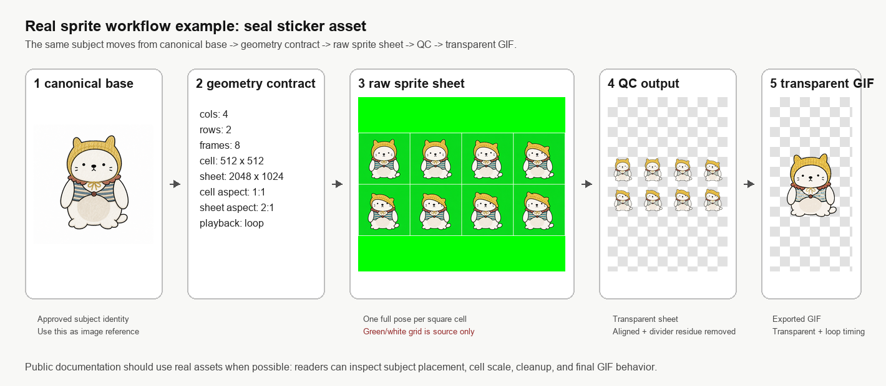
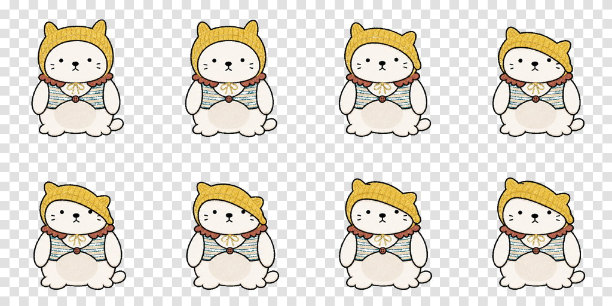
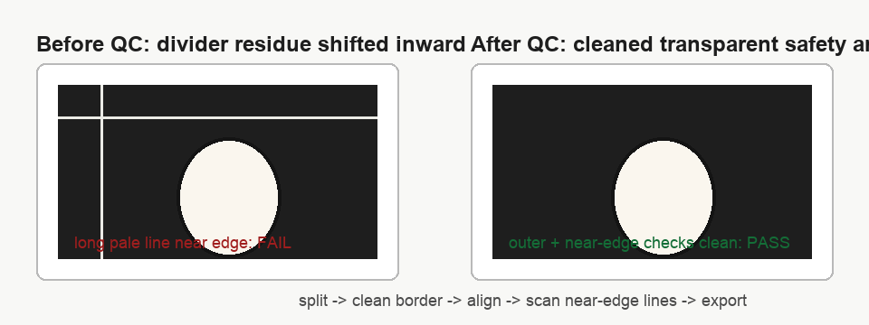

# animation-qc

把已有 sprite sheet 处理成可用于产品 UI 的透明动画资产。

这个 skill 负责 **生图后** 的技术质检：切帧、去绿、去边线、透明导出、主体对齐、节奏检查、报告输出。  
如果还没有图，先使用 [`animation-sprite-workshop`](../animation-sprite-workshop/README.md)。



## 总流程

```mermaid
flowchart LR
  A["raw sprite sheet"] --> B["split cells"]
  B --> C["remove green / cleanup"]
  C --> D["clear original cell border"]
  D --> E["remove near-edge divider lines"]
  E --> F["align body center / baseline"]
  F --> G["clear border again"]
  G --> H["scan edge artifacts"]
  H --> I["export transparent GIF"]
  I --> J["report + timing advice"]
```



## 1. 输入要求

最理想的输入：

- 规则网格，例如 `4x2`、`3x2`、`4x4`。
- 每个 cell 尺寸相同，最好是正方形。
- 背景是透明或可抠除的纯色绿。
- 每格一个完整动作帧。
- 角色主体中心和接触线大致稳定。

如果来自 `animation-sprite-workshop`，先确保 raw sheet 已通过 `check_sprite_gate.py`。

## 2. 准备 anchor profile

角色类动画建议传入 `anchor_profile`，否则 QC 只能用通用前景检测，遇到道具、长头发、披风、特效时更容易误判。

示例：

```json
{
  "name": "example character",
  "subject_type": "character",
  "anchor_profile": {
    "center_anchor": "body_visual_center",
    "baseline_anchor": "contact_baseline",
    "ignore_for_center": ["ears", "tail", "small hand motion", "props", "motion lines"],
    "baseline_rule": "Grounded frames keep the same contact line unless jump/fall/slide/float/travel is explicit."
  }
}
```

## 3. 运行 QC

```bash
python3 scripts/process_sprite.py \
  --input /path/to/raw-sheet.png \
  --out /path/to/output-dir \
  --scene qc \
  --action example-action \
  --cols 4 \
  --rows 2 \
  --playback loop \
  --anchor-profile /path/to/anchor-profile.json \
  --clear-border 4 \
  --line-clean-margin 40
```

会得到：

- `qc-example-action-aligned-transparent.png`：处理后的透明 sprite sheet。
- `qc-example-action-preview.gif`：带浅色背景的检查预览。
- `qc-example-action-transparent.gif`：最终透明 GIF。
- `qc-example-action-audit.png`：前后对齐检查图。
- `qc-example-action-report.json`：完整 QC 报告。
- `qc-example-action-timing.json`：实际导出的帧序和时长。
- `qc-example-action-rhythm-advice.json`：节奏建议。

真实示例：



最终透明 GIF：


## 4. 边线清理顺序

可见网格源图最容易留下白线、绿线、黑线。清理顺序必须固定：

```text
split cell
-> remove green
-> clear original cell border
-> remove near-edge divider lines
-> align
-> clear border again
-> scan near-edge divider lines
-> export gif
```

原因：如果先对齐再清理，原本在 cell 边缘的白色分隔线可能被整体平移进画面内部，变成 `x=14`、`x=20` 这种位置的长白线。

示意：



## 5. 报告怎么看

重点先看这几组字段：

```json
{
  "edge_artifacts": {
    "status": "pass",
    "outer_border_clean": true,
    "near_edge_long_line_clean": true
  },
  "gif_export": {
    "transparent_index_ok": true,
    "gif_background_index_ok": true
  },
  "aligned": {
    "body_cx_range": 2.0,
    "vertical_anchor_range": 0
  }
}
```

含义：

- `outer_border_clean`：最外圈没有残留黑/绿边。
- `near_edge_long_line_clean`：近边区域没有被平移进来的长白线/浅色线。
- `transparent_index_ok`：透明 GIF 的透明索引正确。
- `gif_background_index_ok`：GIF background index 和透明索引一致，降低播放时闪线风险。
- `body_cx_range`：主体中心横向漂移范围。
- `vertical_anchor_range`：接触线或垂直锚点漂移范围。

不要只看一个模糊的 `edge_artifacts: pass`。公共版 QC 要把失败模式拆开看。

## 6. 节奏和循环

`--playback loop`：

- 默认 GIF 无限循环。
- 首尾要接得上。
- 不要在最后一帧长停到像卡住。

`--playback once`：

- 默认不是无限循环。
- 最后一帧可以更长，方便作为结束状态。

如果觉得太快，优先调 `--durations`，不要急着重画。

示例：

```bash
python3 scripts/process_sprite.py \
  --input /path/to/raw-sheet.png \
  --out /path/to/output-dir \
  --cols 4 \
  --rows 2 \
  --playback loop \
  --frames 0,1,2,3,4,5,6,7,6,5,4,3,2,1 \
  --durations 600,260,300,340,420,500,600,900,500,420,360,320,280,420
```

## 7. 什么时候不要继续修

QC 可以修机械问题，但不能补救所有生图问题。

应该回到生成阶段的情况：

- 帧内容本身不是连续动作。
- 角色换脸、换比例、换服装。
- cell 太小，细节糊成一团。
- 道具/特效和主体粘连，无法稳定判断 anchor。
- 清边会切到角色主体。
- 需要文字、粒子、光效、分层遮罩等复杂 UI ceremony。

这类情况应回到 `animation-sprite-workshop`，重新生成更清晰、更大 cell、更少批次的 raw sheet。

## 文件说明

- `SKILL.md`：agent 使用规则。
- `scripts/process_sprite.py`：切帧、去绿、对齐、透明 GIF、报告、节奏建议。
- `scripts/make_sequence_preview.py`：序列预览辅助工具。
- `scripts/audit_product_usage.py`：产品接入检查辅助工具。
- `docs/images/`：公共文档示例图。
