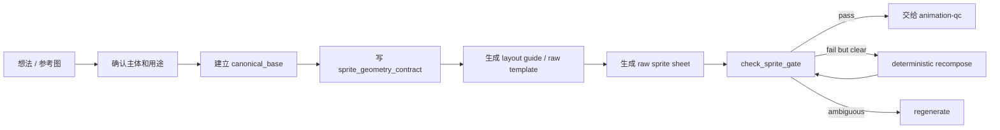

# animation-sprite-workshop

把一个“我想让角色/物件动起来”的想法，整理成可生成、可检查、可交给 `animation-qc` 的雪碧图生产流程。

这个 skill 负责 **生图前** 的规划：角色基准、动作意图、帧数/格子、layout guide、raw sheet 约束和基础 gate。  
图片已经生成以后，交给 [`animation-qc`](../animation-qc/README.md)。


## 总流程



## 1. 确认主体

适用场景：

- 新角色、新贴纸主体、新宠物、小物件动画。
- 用户给了参考图，但还没有干净的动画基准图。
- 用户要同一个角色继续做很多表情包。

要确认：

- 是借风格，还是保留同一个角色。
- 是否需要生成干净的 `canonical_base`。
- 角色的脸、比例、服装、轮廓、线条风格是否通过。

产物：

- `canonical_base`：后续动作生成的视觉源。
- `anchor_profile`：给 QC 用来判断主体中心和接触线。

## 2. 写 sprite_geometry_contract

每次生成可播放 sprite 前，先写清楚几何合同。不要只在 prompt 里写“4x2 格子”，要写成机器能检查的目标。

示例：

```yaml
sprite_geometry_contract:
  cols: 4
  rows: 2
  frame_count: 8
  target_canvas_px: [2048, 1024]
  target_cell_px: [512, 512]
  cell_aspect: 1:1
  whole_sheet_aspect: 4:2
  valid_cells: [1,2,3,4,5,6,7,8]
  empty_cells: []
  playback: loop
  background: chroma_green
  raw_sheet_format: chroma_green_with_white_dividers
  anchor_policy: body center stable, contact baseline stable
```

关键规则：

- 每个 cell 必须是 `1:1`。
- 整张图比例必须等于 `cols:rows`。
- 生成 prompt 里要明写：`4 columns x 2 rows`、`whole sheet aspect ratio 2:1`、`every cell exactly square`。
- 生图后看真实文件尺寸，不看预览感觉。

## 3. 生成 layout guide

layout guide 是给模型看的施工图，不是最终图。它可以有线、文字、center、baseline。

```bash
python3 scripts/make_layout_guide.py \
  --cols 4 \
  --rows 2 \
  --cell 160 \
  --mode guide \
  --labels idle,wave \
  --out docs/images/layout-guide-4x2.png
```

会得到：


## 4. 生成 raw template

raw template 是更强的生产约束：绿色背景、白色分隔线、每格一个完整动作帧。它不是最终透明资产，而是后续切帧/QC 的中间源。

```bash
python3 scripts/make_layout_guide.py \
  --cols 4 \
  --rows 2 \
  --cell 160 \
  --mode raw-template \
  --out docs/images/raw-template-4x2.png
```

会得到：


模板只是结构；真正的 raw sheet 应该让每个格子都有一个完整主体，并且主体不能跨格、不能贴边、不能把网格线当作角色线条：


这张图里可以直接检查三件事：

- 每个 `1:1` cell 里都有一个完整主体。
- 整张图是 `4x2`，比例是 `2:1`。
- 绿色背景和白色分隔线只是中间源，不能作为最终透明资产。

## 5. 生图 prompt 要写死几何

prompt 中必须带上几何约束：

```text
Create a raw production sprite sheet.
4 columns x 2 rows, 8 frames total.
Whole sheet aspect ratio exactly 2:1.
Every cell is exactly square.
Each frame stays fully inside its own 1:1 cell.
Use pure chroma green background and thin white dividers.
No labels, no numbers, no guide marks.
Keep the body center and contact baseline stable.
```

如果使用参考角色，必须把 `canonical_base` 作为真实图像输入，不能只在 prompt 里写本地路径。

## 6. 生图后先跑 basic sprite gate

```bash
python3 scripts/check_sprite_gate.py \
  --input /path/to/raw-sheet.png \
  --cols 4 \
  --rows 2 \
  --target-width 2048 \
  --target-height 1024 \
  --target-cell 512 \
  --allow-guide-background \
  --check-visible-grid
```

会得到 JSON：

```json
{
  "status": "pass",
  "route": "split_or_qc_next",
  "size": [2048, 1024],
  "cell": [512, 512]
}
```

如果失败：

- `pass`：进入 `animation-qc`。
- `fail but visually clear`：只能做确定性 recompose/resize，不能补画、不能发明帧。
- `ambiguous`：重新生成，或者拆成更小批次。

## 7. 交给 animation-qc

workshop 到这里结束。下一步用 QC 做：

- 背景清理和透明 GIF。
- 对齐主体中心和接触线。
- 清除绿边、白线、黑线。
- 生成 preview GIF、transparent GIF、audit、report、timing。

最小交接信息：

```yaml
raw_sheet: /path/to/raw-sheet.png
cols: 4
rows: 2
playback: loop
anchor_profile: /path/to/anchor-profile.json
expected_output: transparent gif + report
```

## 常见错误

- 只写“4x2”，但没有写整图比例和单格正方形。
- 预览看着像格子，但真实尺寸不是 `cols:rows`。
- layout guide 被模型画进最终图。
- raw sheet 没过 gate 就直接进 QC。
- 角色太复杂还塞进太小的 cell，导致糊、缺细节、边线难清。

## 文件说明

- `SKILL.md`：agent 使用规则。
- `scripts/make_layout_guide.py`：生成 layout guide 或 raw template。
- `scripts/check_sprite_gate.py`：检查 raw sheet 几何是否能机器切帧。
- `docs/images/`：公共文档示例图。
